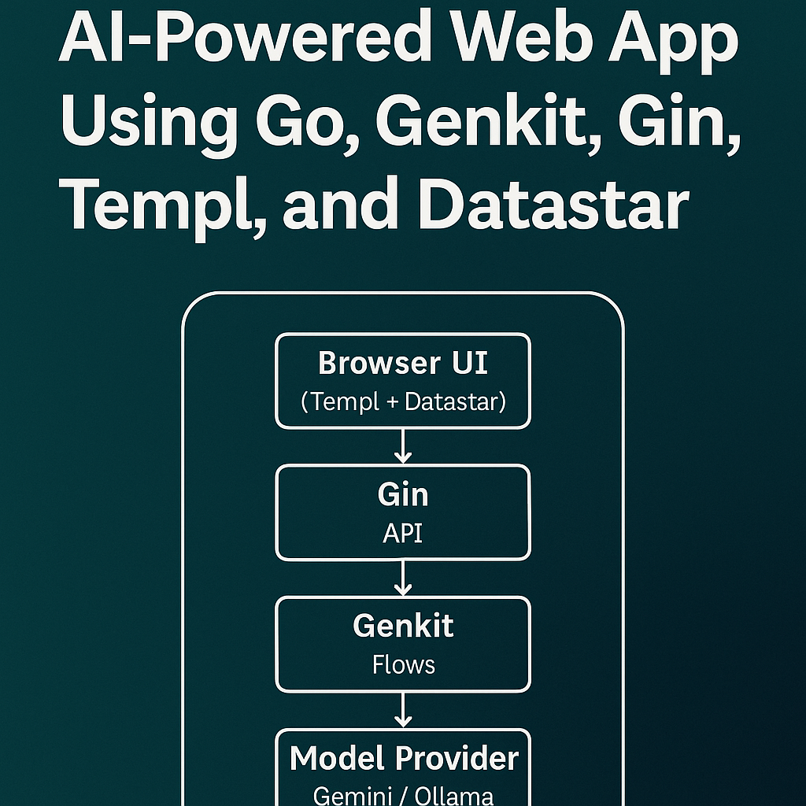

# AI-Powered Welcome Note Generator



A production-ready AI application built entirely in Go, showcasing the evolution from simple prompts to sophisticated multi-stage LLM pipelines with content moderation and natural language understanding.

## Overview

This project demonstrates how to build a complete, production-quality AI application using only Go—no React, no Node, no Python. It features:

- 🤖 **Five Progressive AI Flows** — From simple string generation to smart NLP interpretation
- 🛡️ **Content Moderation** — Multi-stage pipeline with safety filters
- 🎯 **Type Safety** — Structured inputs and outputs end-to-end
- ⚡ **Reactive UI** — Server-Sent Events (SSE) with zero JavaScript
- 🐳 **Production Ready** — Docker deployment, rate limiting, CSRF protection
- 📊 **Observable** — Built-in tracing and flow visualization via Genkit

## Tech Stack

**Backend:**
- **[Genkit](https://firebase.google.com/docs/genkit)** — AI flow orchestration
- **[Gin](https://gin-gonic.com/)** — HTTP routing and middleware
- **Gemini 2.0 Flash** — Fast, powerful LLM
- **[Ollama](https://ollama.ai/)** — Local model support

**Frontend (Go-only):**
- **[Templ](https://templ.guide/)** — Type-safe HTML templates
- **[Datastar](https://data-star.dev/)** — Reactive UI via SSE
- **[Tailwind CSS](https://tailwindcss.com/)** — Styling

**Production:**
- Rate limiting (configurable, per-IP)
- CSRF protection
- Structured logging
- Docker deployment

## Architecture

```
          ┌──────────────────────────────┐
          │          Browser UI          │
          │  (Templ + Datastar + HTMX)   │
          └──────────────┬───────────────┘
                         │
                HTTP Form / SSE Streams
                         │
              ┌──────────▼───────────┐
              │         Gin          │
              │   (Handlers & API)   │
              └──────────┬───────────┘
                         │
                  Call Genkit Flow
                         │
            ┌────────────▼────────────┐
            │         Genkit          │
            │  Flows / Prompts / AI   │
            └────────────┬────────────┘
                         │
            ┌────────────▼─────────────┐
            │      Model Provider      │
            │   (Gemini / Ollama)      │
            └──────────────────────────┘
```

## The Five Flows

### V1 — Simple Prompt
**Input:** String (e.g., "birthday party")
**Output:** Welcome note text

The foundation. A typed Go function that takes a string, generates text, and returns it.

### V2 — Structured Input
**Input:** Structured fields (occasion, language, length, tone)
**Output:** Welcome note text

Users get control through clean dropdowns instead of a single text box.

### V3 — Structured Output
**Input:** Structured fields
**Output:** JSON with note + metadata

The LLM returns typed JSON with sentiment, safety scores, and extracted context. Genkit handles validation automatically.

### Safe Flow — Content Moderation
**Input:** Structured fields
**Output:** Note + moderation status + sanitized version

A two-stage pipeline:
1. Generate the note
2. Moderate with a second LLM call
3. Sanitize if flagged and return both versions

### Smart Flow — Natural Language Interpretation
**Input:** Free-form description (e.g., "short, friendly note for hotel guests")
**Output:** Interpreted parameters + generated note + moderation

The full pipeline:
1. **Interpret** natural language → structured parameters
2. **Generate** note using V3 flow
3. **Moderate** for safety

## Quick Start

### Prerequisites

- Go 1.25+
- Docker & Docker Compose (for containerized deployment)
- Gemini API key (or Ollama for local models)

### Local Development

1. **Clone the repository**
   ```bash
   git clone https://github.com/your-username/welcome-note-generator.git
   cd welcome-note-generator
   ```

2. **Set environment variables**
   ```bash
   cp .env.example .env
   # Edit .env with your API key
   ```

3. **Run with Go**
   ```bash
   go run cmd/web/main.go
   ```

4. **Visit the app**
   ```
   http://localhost:8080
   ```

### Docker Deployment

See [DOCKER.md](DOCKER.md) for comprehensive Docker deployment instructions.

**Quick start:**
```bash
docker-compose up -d
```

## Environment Variables

| Variable | Description | Default |
|----------|-------------|---------|
| `GEMINI_API_KEY` | Google Gemini API key | Required |
| `PORT` | Server port | `8080` |
| `CSRF_KEY` | 32-byte CSRF key (hex) | Auto-generated |
| `CSRF_TRUSTED_ORIGINS` | Comma-separated trusted origins | Empty |
| `RATE_LIMIT_REQUESTS_PER_MINUTE` | Rate limit per IP | `30` |
| `RATE_LIMIT_BURST_SIZE` | Rate limit burst size | `5` |
| `RATE_LIMIT_CLEANUP_INTERVAL` | Cleanup interval | `5m` |
| `RATE_LIMIT_LIMITER_TTL` | Limiter TTL | `15m` |

## Project Structure

```
.
├── cmd/
│   └── web/
│       └── main.go              # Application entry point
├── internal/
│   ├── flows/                   # All 5 Genkit flows
│   │   ├── v1.go               # Simple prompt flow
│   │   ├── v2.go               # Structured input flow
│   │   ├── v3.go               # Structured output flow
│   │   ├── safe_flow.go        # Moderation pipeline
│   │   └── smart_flow.go       # NLP interpretation flow
│   └── types/                   # Shared types
├── web/
│   ├── handlers/                # HTTP handlers
│   ├── middleware/              # Rate limiting, CSRF, logging
│   ├── templates/               # Templ components
│   ├── utils/                   # Datastar helpers
│   └── config/                  # Configuration
├── Dockerfile                   # Multi-stage Alpine build
├── docker-compose.yml           # Docker deployment
└── README.md                    # This file
```

## Key Features

### Type-Safe AI Flows

```go
type WelcomeInput struct {
    Occasion string `json:"occasion"`
    Language string `json:"language"`
    Length   string `json:"length"`
    Tone     string `json:"tone"`
}

type WelcomeOutput struct {
    Note     string            `json:"note"`
    Metadata map[string]string `json:"metadata"`
}

resp, err := genkit.GenerateData[WelcomeOutput](
    ctx, g,
    ai.WithSystem(systemPrompt),
    ai.WithPrompt(userPrompt),
)
```

### Content Moderation Pipeline

```go
// Stage 1: Generate
note := generateWelcomeNote(input)

// Stage 2: Moderate
moderation := moderateContent(note)

if moderation.Blocked {
    return SafeOutput{
        Note:           moderation.SanitizedNote,
        OriginalNote:   note,
        Blocked:        true,
        ModerationNote: moderation.Reason,
    }
}
```

### Reactive UI (No JavaScript)

```html
<form data-on:submit="@post('/api/v3/generate')">
  <input name="occasion" />
  <button>Generate</button>
</form>

<div data-text="$v3Tab.result.note"></div>
```

The server streams updates via SSE, and Datastar updates the DOM reactively.

## Development

### Running Tests

```bash
go test ./...
```

### Building for Production

```bash
CGO_ENABLED=0 GOOS=linux go build -ldflags="-w -s" -o welcome-note-web ./cmd/web
```

### Genkit Developer UI

View flow traces and observability:

```bash
# In development mode, Genkit UI is available at:
http://localhost:8080/__/genkit
```

## Production Deployment

### Google Cloud Run

```bash
# Build and push
docker build -t gcr.io/your-project/welcome-note-generator .
docker push gcr.io/your-project/welcome-note-generator

# Deploy
gcloud run deploy welcome-note-generator \
  --image gcr.io/your-project/welcome-note-generator \
  --platform managed \
  --region us-central1 \
  --set-env-vars GEMINI_API_KEY=your-key
```

See [DOCKER.md](DOCKER.md) for more deployment options.

## Learn More

📖 **Read the full article:** [Building an AI-Powered App Entirely in Go](article_final.md)

The article walks through:
- The evolution from V1 to Smart Flow
- Technical deep dives on CSRF, rate limiting, and reactive UI
- Lessons learned at each stage
- Why this architecture scales

## Contributing

Contributions are welcome! Please feel free to submit a Pull Request.

## License

MIT License - see [LICENSE](LICENSE) for details.

## Acknowledgments

- [Firebase Genkit](https://firebase.google.com/docs/genkit) for AI orchestration
- [Gin](https://gin-gonic.com/) for HTTP framework
- [Templ](https://templ.guide/) for type-safe templates
- [Datastar](https://data-star.dev/) for reactive UI

---

**Built with Go 1.25, Genkit 1.2, and a love for clean code.**

🚀 **[Live Demo](#)** | 📝 **[Medium Article](#)** | 🐛 **[Report Issue](https://github.com/your-username/welcome-note-generator/issues)**
